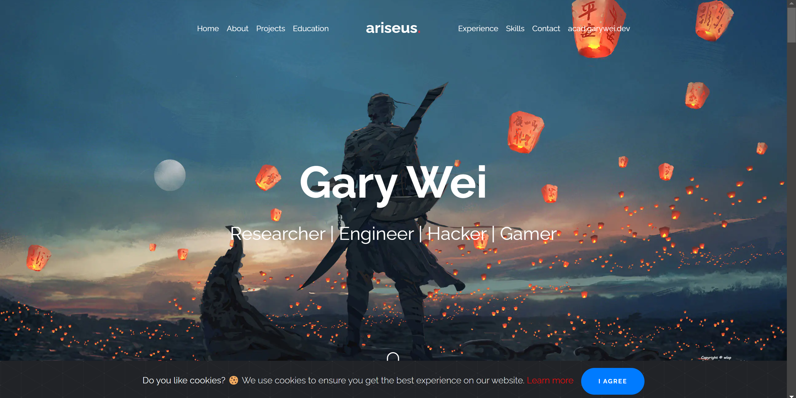
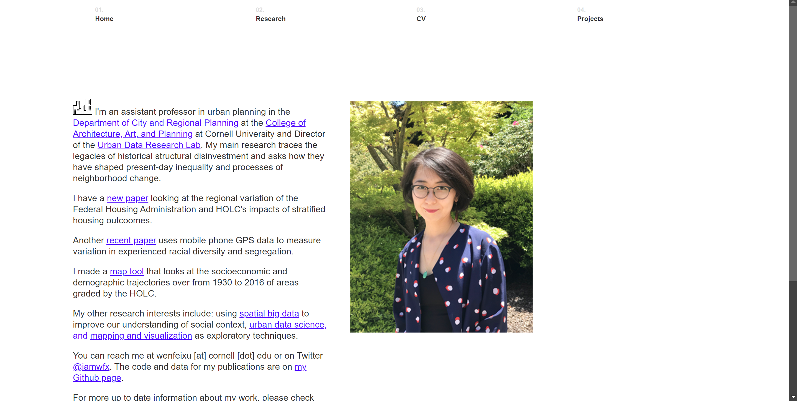

# Project 1, Milestone 1: Design Journey

[← Table of Contents](design-journey.md)

**Replace ALL _TODOs_ with your work.** (There should be no TODOs in the final submission.)

Be clear and concise in your writing. Bullets points are encouraged.

Place all design journey images inside the "design-plan" folder and then link them in Markdown so that they are visible in Markdown Preview.

**Everything, including images, must be visible in _Markdown: Open Preview_.** If it's not visible in the Markdown preview, then we can't grade it. We also can't give you partial credit either. **Please make sure your design journey should is easy to read for the grader;** in Markdown preview the question _and_ answer should have a blank line between them.

## Website Topic
> Briefly explain what your website will be about. Share your vision of your personal website. (1 sentence)

My website will introduce my hobbies in geography and urban studies.

## Personal Website Design Exploration

Identify two personal websites (preferably static websites) that exist today on the web. You will be drawing inspiration from these sites for your own site; **please select websites that are similar to the website you wish to create**. You may not use the instructor's website or template websites for this part; the example websites should be real personal websites that exist on the web.

Include a **mobile** screenshot of the home page for each site. (If you're taking a screenshot on your laptop, resize your browser window to a mobile size before taking the screenshot.)

**We'll refer to these are your "example websites."**

### Personal Website 1 Review

<https://www.garywei.dev/>

- Who do you think this site is designed for? Who is its intended audience?

    This site is designed to introduce the owner himself, and the intended audience are fellow students who want to know more about the owner.

- What **goals** do you think the audience likely has when visiting this site.

    The audience wants to know more about the owner of the website for making friends, hire employees (members in a club), etc.

- What **content** is included in this personal website?

    His hobbies, working and education experiences, and skills. Some of the parts have brief introduction for specification.

- Do you believe the content likely **addresses** the goals of the site's audience?

    Yes, the site introduces the owner himself comprehensively.

- What do you like about the design?

    I think the design is very cool. It has some animation effects that clearly illustrate his content in a fancy way.

### Personal Website 2 Review

<https://www.wenfeixu.com/>

- Who do you think this site is designed for? Who is its intended audience?

    This site is designed for the owner to introduce her academic experiences, and the intended audience are scholoars who share similar interests in urban planning.

- What **goals** do you think the audience likely has when visiting this site.

    The audience would like to find the latest research of Professor Xu and to know what she is currently working on.

- What **content** is included in this personal website?

    The website includes her education and academic experience, introduction of her academic concentration, and some research findings.

- Do you believe the content likely **addresses** the goals of the site's audience?

    Yes, the website clearly conveys the information the audience wants, which is mostly about academic.

- What do you like about the design?

    I think the overall design is good. The design is a little simple while it successfully conveys the information.

## Audience
> Briefly explain who the intended audience is for your website. (1 sentence)

The intended audience is fellow students who share similar interests in geography as me (probably students major in urban planning).

## Audience Goals
> Why would your audience visit your site?
>
> Identify at least 3 goals that your users have for visiting your website.

1. Know more about my interests to make friend with me

2. Know my new findings in geogrpahy to broaden their knowledge

3. Know clubs and interns from my experience to find more opportunities

## Audience Reflection
> Your audience should be a **cohesive** group of people with similar goals.
> Your audience should not be overly broad. (i.e. "recruiters")
> Your audience should not be arbitrary specific. (i.e. "recruiters located in midtown NYC")
> Your audience should describe a group of people who have the same goals.
>
> Explain why your audience is a cohesive group of people with uniform goals. (1-2 sentences)

My intended audience all share interests in geography and all want to find more opportunities in related fields.

## Content Reflection
> Review the example website's content for inspiration.
> Review your audience's goals.
> Identify the content your audience would need to achieve their goals.

- Brief introduction about myself, especially my hobbies and interests, such as the books I read and the activities I've done.
- Publish some of my findings in urban planning, such as the maps I made and book reviews I wrote.
- List my intern and club experiences that include the company and the organization's name.

## Planned Content
> List **all** the content you plan to include in your personal website.
>
> **Do not include your actual content here!** (All content should be located in the `design-plan/m1-content` folder.)
> Simply provide a **very short description** of each piece of content.
>
> Examples:
>
> - headshot image
> - bio paragraph
> - PDF of class schedule
> - screenshot of main app screen of XYZ project
>
> You should list all types of content you planned to include (i.e. text, photos, images, etc.)

- headshot image
- bio paragraph
- education experiences
- Related courses taken
- Contact
- Projects: The introduction of my participation in the project "Healthy Streets for Beijing"
- Projects: The design graphs of my street renovation plan
- Projects: My reflection to the GIS project in Atlanta with maps I drew
- Book Reviews: My understanding to the book "The Death and Life of Great American Cities" with the picture of the book cover
- Experiences: My clubs experience at "Mapping Society at Cornell"

## Content Justification
> Explain why this content is the right content for your site's audience and how the content addresses their goals.
> (2-4 sentences)

All the contents are about my experiences in geography, which can show fellow students my interests and findings in this area. The Health Street project and GIS project may give the audience new ideas in urban planning, while the clubs and interns may introduce them with new opportunities in related fields.

## Home Page Content
> What is the content that your users would expect when visiting your site for the first time.
> **List** what content you will include on the homepage.

- bio paragraph
- education experiences
- related courses taking
- contact

## References

### Collaborators
> List any persons you collaborated with on this project.

None

### Reference Resources
> Did you use any resources not provided by this class to help you complete this assignment?
> Cite any external resources you referenced in the creation of your project. (i.e. W3Schools, StackOverflow, Mozilla, etc.)
>
> List **all** resources you used (websites, articles, books, etc.), including generative AI.
> Provide the URL to the resources you used and include a short description of how you used each resource.

chatgpt.com
I used ChatGPT as a generative AI to write most text contents for my website.

I created gisatlanta.png healthystreet.png myself using ArcGIS and SketchUp respectively.

https://www.tim-power.com/the-death-and-life-of-great-american-cities/
The cover of the book The Death and Life of Great American Cities comes from the above website.

I changed the indentation of my html as my revision for milestone 1.

[← Table of Contents](design-journey.md)
