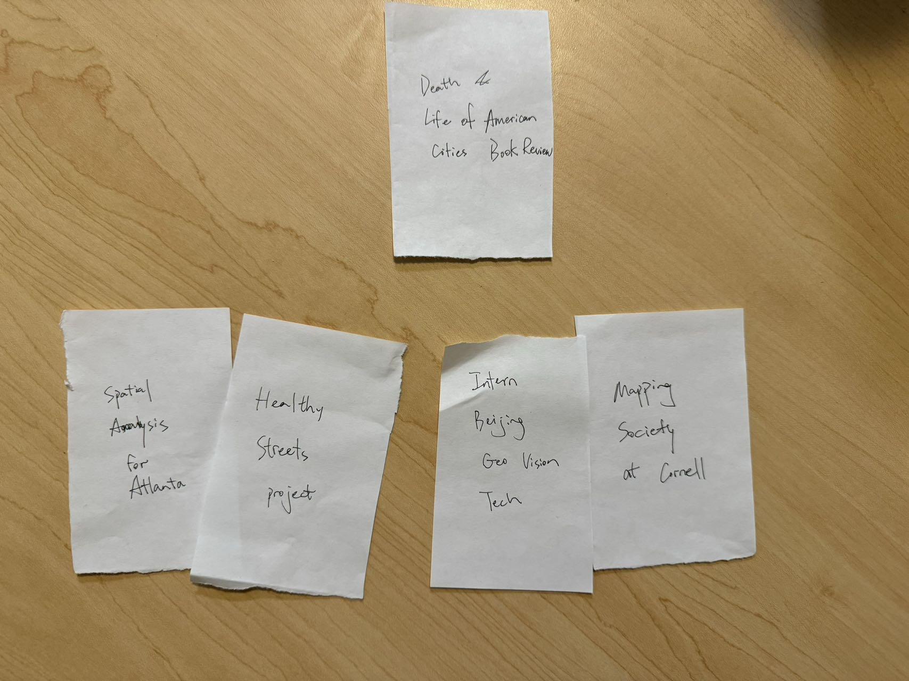

# Project 1, Milestone 3: Design Journey

[← Table of Contents](design-journey.md)

**Replace ALL _TODOs_ with your work.** (There should be no TODOs in the final submission.)

Be clear and concise in your writing. Bullets points are encouraged.

Place all design journey images inside the "design-plan" folder and then link them in Markdown so that they are visible in Markdown Preview.

**Everything, including images, must be visible in _Markdown: Open Preview_.** If it's not visible in the Markdown preview, then we can't grade it. We also can't give you partial credit either. **Please make sure your design journey should is easy to read for the grader;** in Markdown preview the question _and_ answer should have a blank line between them.

## Milestone 2 Feedback Revisions
> Explain what you revised in response to the Milestone 2 feedback (1-2 sentences)
> If you didn't make any revisions, explain why.

I added two descendant combinator selectors in my site.css file. I specified the strong and mark in sections by adding "section strong" and "section mark" selectors.

## Information Architecture

Design the information architecture for all the pages your website.

You may change your homepage content based on your card sorting. If you do change the homepage content, you don't need to go back to the previous milestone design journey and update it. Instead, just include the new plan in the section below (Content Organization).

### Content Organization
> Document your **iterations** of card sorting here.
> You should have at least 2 iterations of card sorting.
> Include photographic evidence of each iteration of card sorting **and** description of your thought process for each iteration. (1-2 sentences)
> Please physically sort cards; please don't do this digitally.

I listed five activities that will be posted on my website, which are the Healthy Street Project, Mapping Society at Cornell, Beijing Geo Vision Technology Intern, Spatial Analysis for Atlanta, and my reading on The Death and Life of Great American Cities. Then, I made two iterations.

The first iteration is about the content of the activity. The Mapping Society, GeoVision Intern, and Spatial Analysis project are all about maps, while the book and the Healthy Street project are not strongly related to maps but more about sociology concepts.

The second iteration is about how the activity is accomplished. The Mapping Society and GeoVison Intern are both attached to an agency and the works are accomplished by a group of people collectivley. The Spatial Analysis and the Healthy Street project are both individual projects, while the book review is not a project but some thoughts to share.

### Final Content Organization
> Which iteration of card sorting will you use for your website? (1 sentence)

I plan to use the second iteration.

> Explain how the final organization of content is appropriate for your site's audiences. (1-2 sentences)

I will devide my works in three categories. The first is called "Projects", which are individual projects accomplished by myself. One of my website's goals is to enlighten audience with similar interests in geography and cities. My projects may give them new ideas. The second category is "Experiences", which include my intern and club experiences for introducing more career and academic opportunities for students sharing similar interests (which is another goal of the website). The third category is "thoughts", which include the book review that can share people my points and create a space to discuss.

### Navigation
> Please list the pages you will include in your website's navigation.

- Projects
- Experiences
- Thoughts
- ...

> Explain why the names of these pages make sense for your site's audience. (1-2 sentences)

The names are short and clear, which can directly tell audience what the contents are, and the contents are what they want as explained in the previous question.

## References

### Collaborators
> List any persons you collaborated with on this project.

None

### Reference Resources
> Did you use any resources not provided by this class to help you complete this assignment?
> List any external resources you referenced in the creation of your project. (i.e. W3Schools, StackOverflow, Mozilla, etc.)
>
> List **all** resources you used (websites, articles, books, etc.), including generative AI.
> Provide the URL to the resources you used and include a short description of how you used each resource.

None

[← Table of Contents](design-journey.md)
