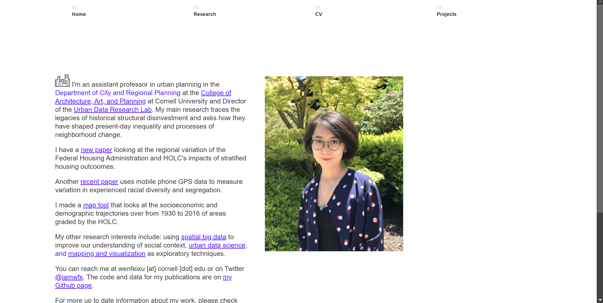

# Project 1, Final Milestone: Design Journey

[← Table of Contents](design-journey.md)

**Replace ALL _TODOs_ with your work.** (There should be no TODOs in the final submission.)

Be clear and concise in your writing. Bullets points are encouraged.

Place all design journey images inside the "design-plan" folder and then link them in Markdown so that they are visible in Markdown Preview.

**Everything, including images, must be visible in _Markdown: Open Preview_.** If it's not visible in the Markdown preview, then we can't grade it. We also can't give you partial credit either. **Please make sure your design journey should is easy to read for the grader;** in Markdown preview the question _and_ answer should have a blank line between them.

## Milestone 3 Feedback Revisions
> Explain what you revised in response to the Milestone 3 feedback (1-2 sentences)
> If you didn't make any revisions, explain why.

I think I don't need any revision. For Milestone 3, the grader says my content is not cardsorted but is only listed. However, I did sort all my cards into groups.

## Example Website Emotion Analysis

For each example website you identified in milestone 1:

1. Include the same screenshot of the example website you included in Milestone 1.
2. Reflect on the emotions your experience when using the website.
3. Analyze how the website's use of color, decorative imagery, typography, shape, and alignment contribute to these emotions.

### Example Website 1
> Provide the website's URL and a screenshot

<https://www.garywei.dev/>

> What emotions do you feel when you look at this website's design? (1 sentence)

I feel exciting and curious because the website's design is very attractive.

> How does this website's use of color, decorative imagery, typography, shape, and alignment contribute to these emotions? (2-3 sentences)

The background color of this website is black and the content has a padding of bright red, which has a clear contrast. The decorative image is fancy, especially the one on the top of the page, which encourages audience to slide down. The text on the website is aligned left, which is easier to read.

### Example Website 2
> Provide the website's URL and a screenshot

<https://www.wenfeixu.com/>

> What emotions do you feel when you look at this website's design? (1 sentence)

I feel organized but a little bored.

> How does this website's use of color, decorative imagery, typography, shape, and alignment contribute to these emotions? (2-3 sentences)

The background color is white and the texts are in black, which clearly conveys the information. Because the texts are too condensed, it may make readers bored and not concentrate in reading the texts on the website.

## Website Design

### Emotion Reflection
> What emotions would you like the visitors of your website to experience? Why? (1-2 sentences)

I want my visitors to feel exciting and curious. I want to have attractive elements that keep them continue viewing my site.

### Design Principle Brainstorm
> Reflect on how you might use color, decorative imagery, typography, shape, and alignment to evoke these emotions. (2-3 sentences)

I want to use bright colors as my background to make my website more attractive. I want to make each section different colors to distinguish sections from each other. I want to use decorative imageries such as logo to make it more clear. All texts are aligned left for easier to read.

### Home Page Sketches
> Sketch **two** different possible designs for your home page.
> Provide an explanation for each sketch explaining the idea. (1 sentence per sketch)

The headings and content in this sketch are aligned to the left.

The headings and content in this sketch are aligned in the middle.

### Entire Website's Design
> Pick the version of the home page that you will use for your final design.

> Plan the design for the rest of your website.
> Include a sketch for each of the remaining pages of your website.
> Label each sketch, so that we understand what page we are reviewing. (1 short phrase per sketch)

projects

experiences

thoughts

### Static Website Design Check
> We're building a static website without interactivity.
> **No part of your website may dynamically change.**
> Examples of dynamic behavior are dropdown menus, hamburger menus, popups, modals/lightboxes, image carousels, etc.
> Audit your design and check that you aren't relying on any dynamic features. (1 sentence)

All my contents would not change when I put my mouse on them, including my menues.

## Self-Reflection
> Take some time here to reflect on how much you've learned since you started this class. It's often easy to ignore our own progress. Take a moment and think about your accomplishments in this class. Hopefully you'll recognize that you've accomplished a lot and that you should be very proud of those accomplishments!

I learned how to build a simple website with proper structural and design skills. I learned I need to identify my audience and know their demands. Also, I learned I need to finish my plan before implementing the design.
## References

### Collaborators
> List any persons you collaborated with on this project.

None

### Reference Resources
> Did you use any resources not provided by this class to help you complete this assignment?
> List any external resources you referenced in the creation of your project. (i.e. W3Schools, StackOverflow, Mozilla, etc.)
>
> List **all** resources you used (websites, articles, books, etc.), including generative AI.
> Provide the URL to the resources you used and include a short description of how you used each resource.

none

[← Table of Contents](design-journey.md)
